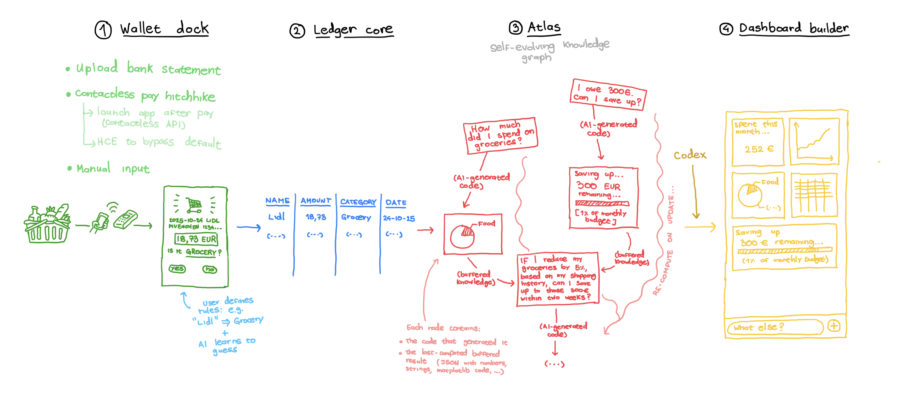

# Lucra
### Know your spend on the go: from contactless ping to tidy auto-classified ledger, a self-evolving knowledge graph on Weaviate powers a fully customizable Codex-driven user dashboard

## 💡 Our concept in 4 parts

### *1. Wallet dock*

User binds their expenses to their Lucra ledger via multiple methods:
   - *Contactless ping*: User taps their phone on a dedicated NFC tag to log an expense. Two ways to do this:
      - Triggering lock-screen on use of Google / Apple Wallet (appLinkData / iBeacon APIs)
      - Host Card Emulation (HCE) to bypass defaul wallets
   - *Bank sync:* User links their bank account for automatic expense tracking
   - *Email parsing:* User forwards their digital receipts to a dedicated email address
   - *Manual entry:* User inputs expenses directly into the app

### *2. Auto-classified ledger*

Vendors, amounts, dates, and categories are parsed and normalized.
Smart categorization engine, feature generation:
   - Rules engine ("Lidl → Groceries")
   - Gradient model (learns from user corrections)
   - Small LLM re-ranker

### *3. Atlas: the self-evolving ontological context network*

The knowledge graphs stacks lines of thought to build rich and indefinitely-complex understanding.

- User queries generate information nodes containing two things:
   - The AI-generated scripts to fetch, compute and answer user queries.
   - Buffered results from previous computation runs; JSONs containing numbers, strings, matplotlib codes, etc.
- On query, the knowledge graph searches itself for relevant nodes to answer user questions, and binds the new node to these context parents. For semantic search, we implement on Weaviate.
- On new expense entry, the knowledge graph re-evaluates existing nodes.
- This is hidden in the backend.

### *4. Codex-driven customizible dashboard*

The knowledge network feeds into a Codex engine that generates user-specific dashboards; whether minimalistic or detailed, the right charts, goal-tracker widgets, warnings, etc.

- Updates live as new expenses are added, quickly accessible.
- User can request new modules via natural language.

## 🚀 What we did

- We prototyped the knowledge graph on Weaviate. See `knowledge-graph/`.
- We prototyped the Codex-driven dashboard generator. See `dashboard-builder/`.
- We designed a visual identity and implemented it as a frontend app. [See here](https://lucra-finance.lovable.app/).

## 🪲 Vulnerabilities

There are two parts of the code that remain highly vulnerable to code injection attacks:
1. The code executor that runs dynamically-generated Python code snippets to compute answers to user queries and process node buffers. Could be sanitized for production, see `knowledge-graph/code_executor.py`.
2. The Codex-driven dashboard generator that inserts HTML snippets into the dashboard. It's only front-end but it should be sanitized to prevent breaking. See `dashboard-builder/frontend/app.js`.

## 🛠️ Setup instructions

### Knowledge graph

1. Install node packages.
2. Set up Weaviate and OpenAI API keys in environment (WEAVIATE_URL, WEAVIATE_API_KEY, OPENAI_API_KEY).
3. See `python3 knowledge-graph/main.py` to see the example provided.

### Dashboard builder

1. Install node packages.
2. Set up OpenAI API key in environment (OPENAI_API_KEY).
3. `npm start` and visit `localhost:5173`.